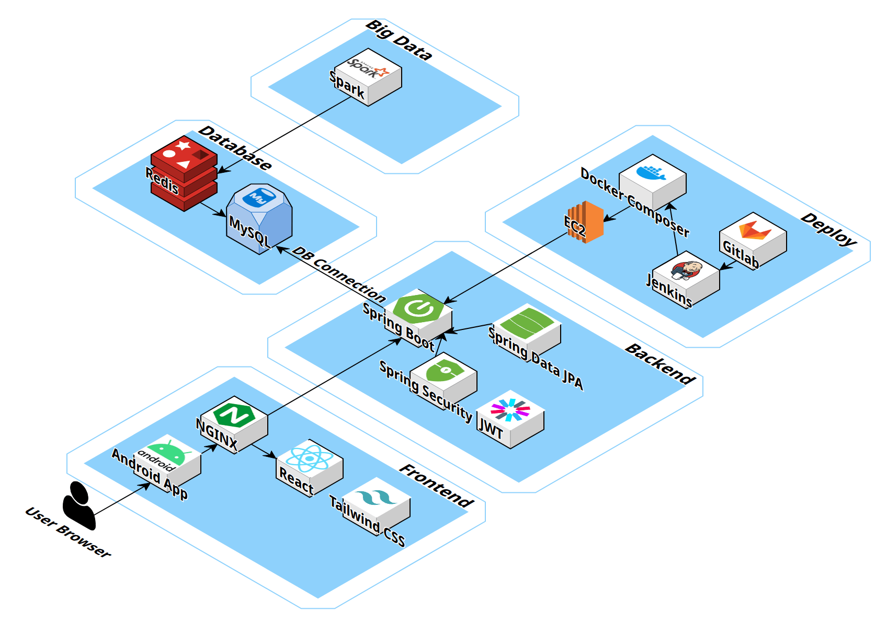
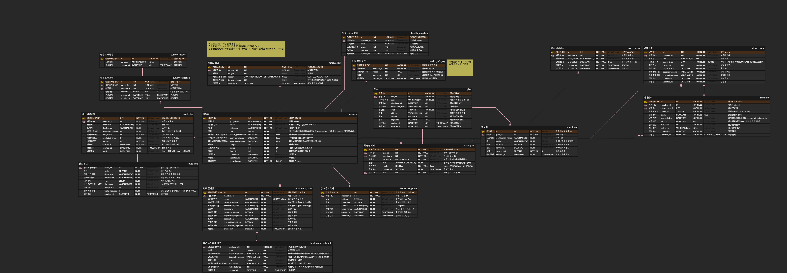

## 덜낑김 - 피로도 기반 경로 추천 어플리케이션

> 빅데이터 기반 개인 맞춤형 피로도 분석·경로 추천 서비스

프로젝트 기간: 2025.08.25 ~ 2025.09.28

---

## 팀 구성

| **역할** | **이름** | **담당 업무** |
| --- | --- | --- |
| **프론트엔드** | **이아영** | **Android Native 앱 설계 및 구현, 네이티브 로그인, 삼성헬스 SDK 데이터 정제 및 연동, 정적 페이지 구현, API 연동** |
| **프론트엔드** | **박승규** | **정적 페이지 구현, 메인 MVP API 연동** |
| **팀장 & 백엔드** | **이현지** | **지하철 데이터 정제, 경로 및 즐겨찾기 API 구현, 최소 피로도 경로 알고리즘 설계** |
| **백엔드**  | **장민석** | **버스 데이터 정제, 알림 및 피로도 API 구현, 피로도 알고리즘 설계** |
| **백엔드** | **주연우** | **환승 데이터 정제, OAuth 인증 및 마이페이지 API 구현, 최소 피로도 경로 알고리즘 설계** |
| **인프라** | **김현재** | **CI/CD 구축, 서버 관리** |

---

## 🛠 기술 스택

| Programming Languages | TypeScript, Java, Kotlin, Python |
| --- | --- |
| Frameworks / Library | React, Jetpack Compose, Spring Boot, Spring Security, Oauth(Google), JWT, Pandas |
| OpenSource | Apache Spark |
| Databases | MySQL, Redis, MinIO(S3) |
| Cloud Services | EC2, MySQL(Azure) |
| Version Control | Git, GitLab, Jira |
| Deployment Tools | Docker, DockerHub |
| CI/CD | Jenkins, Nginx |
| API | ODSay API, Naver Maps/Search/Geocoding API |

## 프로젝트 아키텍처

---

## 주요 서비스 소개

### 최소 피로도 경로 추천

- **혼잡도·거리·환승을 모두 고려한 경로 설계**: 최단거리·최소환승뿐 아니라 **시간대별 정류장·역 혼잡도 데이터**를 함께 고려해, **가장 피로도가 낮은 이동 경로**를 추천
- **데이터 기반 피로도 산정**: 대중교통·시간·피로도 관련 공인 자료, **삼성헬스 수면·활동 지표**, 가입 시 입력한 **체질·환경 민감도 및 교통수단 선호** 설문을 종합해 자체 개발한 **피로도 산식**으로 이동 시 체력 소모를 정량화
- **사용자 중심의 탐색 경험**: 즐겨찾기 기능을 통해 자주 이용하는 **최소 피로도·최단 경로·최소 환승**을 **원클릭**으로 빠르게 조회할 수 있도록 UI·UX를 설계

### 개인 맞춤형 서비스

- **맞춤형 피로도 분석**: 삼성헬스에서 수집한 수면·활동 데이터와 개인 설문 응답을 결합해 **사용자별 피로도 점수**를 산출
- **주간 통계 및 개선 가이드**: 일주일 단위 피로도 추이와 상위 퍼센트(백분위)를 제시하고, 현재 상태에 적합한 **피로 해소·생활 개선 팁**을 제
- **지속 가능한 컨디션 관리**: 데이터를 기반으로 한 **개인화 피드백**을 통해 사용자가 장기적으로 **컨디션을 최적화**하도록 지원

---

## 주요 기술 소개

### ✅ 메달리온 아키텍처

데이터 품질 및 신뢰성 확보를 위해 ‘메달리온 아키텍처’에 따라 데이터를 단계별로 관리

- **Bronze(원천 데이터):** 원본 데이터를 보존하여 데이터 무결성을 유지
- **Silver(정제 및 표준화):** 중복, 결측, 이상치 등을 정리하고 데이터를 표준화 한 데이터셋을 구축
- **Gold(최종 분석):** Silver 데이터를 기반으로 비즈니스 로직에 맞게 집계 및 모델링 된 최종 분석 테이블 완성

### ✅ 레이크하우스 (S3 기반 Spark 분산 처리)

저비용 클라우드 스토리지와 고성능 분산 컴퓨팅의 효율성을 결합

- **스토리지 및 컴퓨팅 분리**: 관계형 데이터베이스 없이 **S3**에 저장된 **Parquet/CSV** 파일을 **Apache Spark**로 직접 처리하여 비용 효율성을 확보함
- **성능 최적화**: 데이터 **파티셔닝(Partitioning)** 및 **프루닝(Pruning)** 기법을 활용하여 대용량 환경에서도 **불필요한 스캔을 최소화**하고 쿼리 지연 시간을 절감

### ✅ 캐싱 및 공간 인덱싱

응답 속도를 극대화 하기 위해 계층적 캐싱 및 공간 인덱싱 사용

- **계층적 캐싱**: 데이터 접근 목적에 따라 필요한 정보만 빠르게 로드하기 위해 `route:{id}` 단위로 **summary, detail, meta** 캐시를 분리
- **실시간 공간 검색**: 정류장 근접 탐색 및 랭킹 조회 작업을 **밀리초(ms) 단위**로 신속하게 처리하기 위해  **HASH/ZSET** 등 공간 인덱싱 기법을 활용

### ✅ Jetpack Compose 기반 네이티브 MVVM 아키텍처

선언적 UI와 상태 관리 아키텍처를 결합해 유지보수성·성능·개발속도를 높임

- **Compose의 반응성 모델과 MVVM의 상태 관리를 효율적으로 결합**하여, 유지 보수성이 높고 성능 최적화가 용이한 모던 안드로이드 아키텍처 구축

---

## 명세서

### API 명세서

[API 명세서 ](https://www.notion.so/API-2531a1b1012f81a3b0d7ec661dd9f0f1?pvs=21)

### 화면 설계서

[A305](http://figma.com/design/psGmaJUksJun2spBhWsG0v/A305?t=KupGvqIGCfDEPHCU-0)

### ERD 설계서

